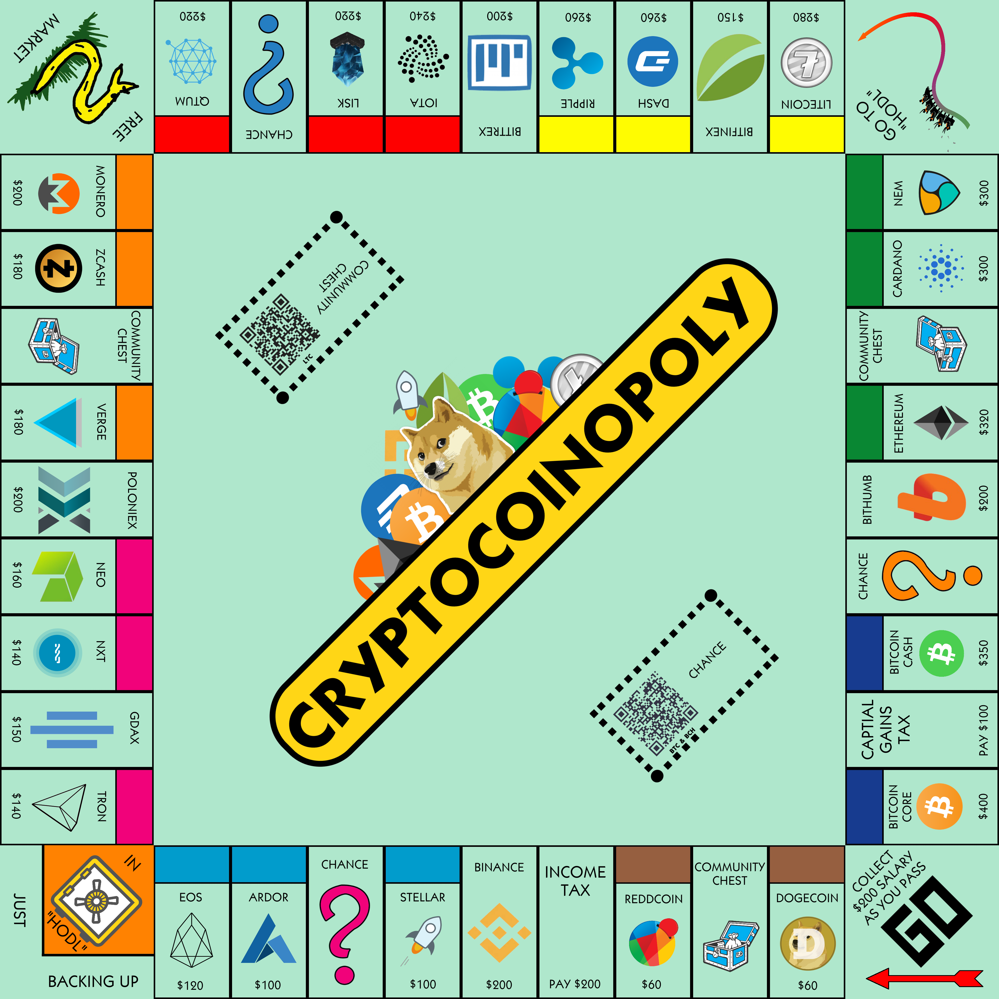

# Cryptocoinopoly
The Crypto trading game.

Finding it difficult to keep your eyes off the markets? Missing out on family time? Why not share your cryptomania with family and friends. Cryptocoinopoly is the cryptocurrency trading game where the aim is to drive everyone else to bankruptcy and for you to centralize the wealth of the internet into your own hands. Acquire some of the most popular cryptocurrencies on the internet, charge players network fees for landing on your cryptos and collect money. Use your money to acquire more cryptocurrencies, build mining rigs and farms and become a whale in the crypto-world. Along the way, market busts, crypto-booms and chance will work in your favour or against.

Wish to share some cryptos?
BTC  - 1EdZugaciEU4psLqM3uj5AoUahC84aBNmx
BCH  - 1EdZugaciEU4psLqM3uj5AoUahC84aBNmx (same as BTC)
LTC  - LcH7epaLTtXxmZJTDf5effHVfvtW22Qbp4
DOGE - DAr3QxF1BQb2uXyPGdkv4wL7EKy9JAXMza
